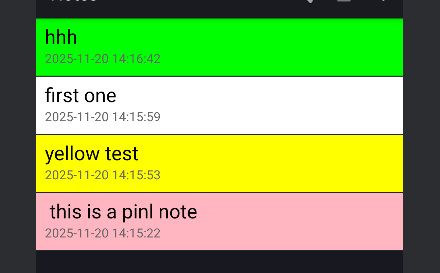
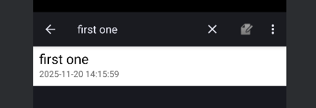
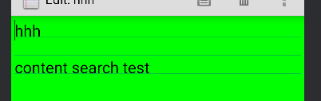
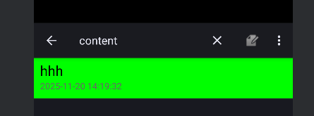
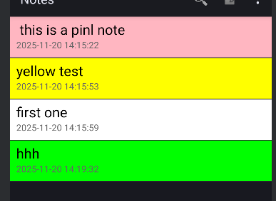
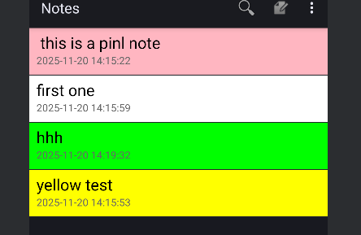
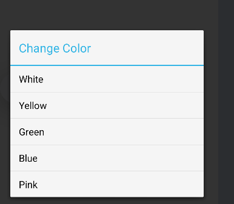
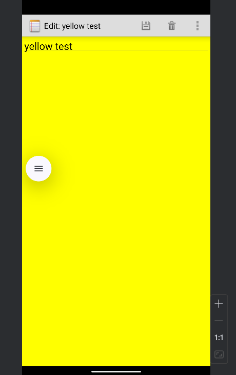

# NotePad 应用扩展功能实现

## 项目简介

本项目基于Android官方早期的NotePad示例应用进行扩展开发，实现了笔记应用的多项实用功能。NotePad是一个简单但功能完整的笔记应用，使用SQLite数据库存储笔记数据，采用ContentProvider进行数据管理。

原项目参考：[Android Sample--NotePad解析](https://blog.csdn.net/llfjfz/article/details/67638499)

## 功能概述

### 基本要求功能

#### 1. 时间戳显示功能
在笔记列表界面中，每条笔记除了显示标题外，还会显示最后修改时间，方便用户了解笔记的更新情况。

**功能特点：**
- 时间格式：yyyy-MM-dd HH:mm:ss
- 显示位置：笔记标题下方
- 自动更新：每次编辑笔记后自动更新时间戳



#### 2. 笔记搜索功能
提供强大的搜索功能，支持根据笔记标题或内容进行实时搜索。

**功能特点：**
- 实时搜索：输入关键词即时显示匹配结果
- 模糊匹配：支持部分关键词匹配
- 搜索范围：同时搜索标题和内容
- 搜索入口：顶部工具栏搜索图标







### 附加扩展功能

#### 3. 笔记排序功能
提供多种排序方式，帮助用户更好地组织和查看笔记。

**排序选项：**
- 按修改时间降序（最新的在前）- 默认排序
- 按修改时间升序（最旧的在前）
- 按标题字母顺序排序

**功能特点：**
- 排序菜单：点击菜单中的"Sort"选项
- 持久化：排序方式在搜索时保持
- 即时生效：选择排序方式后立即更新列表






#### 4. 更换背景颜色功能
为每条笔记设置不同的背景颜色，实现笔记的可视化分类。

**颜色选项：**
- 白色（默认）
- 黄色
- 绿色
- 蓝色
- 粉色

**功能特点：**
- 编辑界面：在笔记编辑页面菜单中选择"Change Color"
- 列表显示：笔记列表中显示对应的背景颜色
- 持久化存储：颜色信息保存在数据库中
- 个性化：每条笔记可以设置不同颜色





## 技术实现详解

### 1. 时间戳显示实现

#### 数据库层面
时间戳数据已经存在于原始数据库中（`modified`字段），无需修改数据库结构。

#### 布局文件修改
修改 `noteslist_item.xml`，添加时间显示TextView：

```xml
<LinearLayout xmlns:android="http://schemas.android.com/apk/res/android"
    android:layout_width="match_parent"
    android:layout_height="?android:attr/listPreferredItemHeight"
    android:orientation="vertical"
    android:paddingLeft="10dip"
    android:paddingRight="10dip">

    <TextView
        android:id="@android:id/text1"
        android:layout_width="match_parent"
        android:layout_height="wrap_content"
        android:textAppearance="?android:attr/textAppearanceLarge"
        android:singleLine="true" />

    <TextView
        android:id="@+id/text_date"
        android:layout_width="match_parent"
        android:layout_height="wrap_content"
        android:textAppearance="?android:attr/textAppearanceSmall"
        android:textColor="#666666"
        android:singleLine="true" />
</LinearLayout>
```

#### Java代码实现
在 `NotesList.java` 中：

1. 修改PROJECTION，添加时间字段：
```java
private static final String[] PROJECTION = new String[] {
    NotePad.Notes._ID,
    NotePad.Notes.COLUMN_NAME_TITLE,
    NotePad.Notes.COLUMN_NAME_MODIFICATION_DATE,
    NotePad.Notes.COLUMN_NAME_BACK_COLOR
};
```

2. 自定义SimpleCursorAdapter，格式化时间显示：
```java
@Override
public View getView(int position, View convertView, ViewGroup parent) {
    View view = super.getView(position, convertView, parent);
    Cursor cursor = getCursor();
    cursor.moveToPosition(position);
    
    // 格式化时间
    int dateIndex = cursor.getColumnIndex(NotePad.Notes.COLUMN_NAME_MODIFICATION_DATE);
    long timestamp = cursor.getLong(dateIndex);
    SimpleDateFormat sdf = new SimpleDateFormat("yyyy-MM-dd HH:mm:ss", Locale.getDefault());
    String dateStr = sdf.format(new Date(timestamp));
    TextView dateView = (TextView) view.findViewById(R.id.text_date);
    dateView.setText(dateStr);
    
    return view;
}
```

### 2. 笔记搜索功能实现

#### 菜单资源添加
在 `list_options_menu.xml` 中添加搜索菜单项：

```xml
<item android:id="@+id/menu_search"
      android:title="@string/menu_search"
      android:icon="@android:drawable/ic_menu_search"
      android:showAsAction="always|collapseActionView"
      android:actionViewClass="android.widget.SearchView" />
```

#### SearchView配置
在 `NotesList.java` 的 `onCreateOptionsMenu` 方法中：

```java
MenuItem searchItem = menu.findItem(R.id.menu_search);
SearchView searchView = (SearchView) searchItem.getActionView();
searchView.setQueryHint("搜索笔记标题或内容");
searchView.setOnQueryTextListener(new SearchView.OnQueryTextListener() {
    @Override
    public boolean onQueryTextSubmit(String query) {
        searchNotes(query);
        return true;
    }

    @Override
    public boolean onQueryTextChange(String newText) {
        searchNotes(newText);
        return true;
    }
});
```

#### 搜索逻辑实现
```java
private void searchNotes(String query) {
    searchQuery = query;
    String selection = null;
    String[] selectionArgs = null;

    if (query != null && !query.trim().isEmpty()) {
        selection = NotePad.Notes.COLUMN_NAME_TITLE + " LIKE ? OR " +
                   NotePad.Notes.COLUMN_NAME_NOTE + " LIKE ?";
        String searchPattern = "%" + query + "%";
        selectionArgs = new String[]{searchPattern, searchPattern};
    }

    Cursor cursor = managedQuery(
        getIntent().getData(),
        PROJECTION,
        selection,
        selectionArgs,
        currentSortOrder
    );

    adapter.changeCursor(cursor);
}
```

**技术要点：**
- 使用SQL的LIKE语句实现模糊搜索
- 同时搜索title和note两个字段
- 实时更新搜索结果

### 3. 笔记排序功能实现

#### 菜单资源
在 `list_options_menu.xml` 中添加排序子菜单：

```xml
<item android:id="@+id/menu_sort"
      android:title="@string/menu_sort"
      android:showAsAction="never">
    <menu>
        <item android:id="@+id/menu_sort_date_desc"
              android:title="@string/menu_sort_date_desc" />
        <item android:id="@+id/menu_sort_date_asc"
              android:title="@string/menu_sort_date_asc" />
        <item android:id="@+id/menu_sort_title"
              android:title="@string/menu_sort_title" />
    </menu>
</item>
```

#### 排序逻辑
```java
private void sortNotes(String sortOrder) {
    currentSortOrder = sortOrder;
    
    String selection = null;
    String[] selectionArgs = null;

    if (searchQuery != null && !searchQuery.trim().isEmpty()) {
        selection = NotePad.Notes.COLUMN_NAME_TITLE + " LIKE ? OR " +
                   NotePad.Notes.COLUMN_NAME_NOTE + " LIKE ?";
        String searchPattern = "%" + searchQuery + "%";
        selectionArgs = new String[]{searchPattern, searchPattern};
    }

    Cursor cursor = managedQuery(
        getIntent().getData(),
        PROJECTION,
        selection,
        selectionArgs,
        currentSortOrder
    );

    adapter.changeCursor(cursor);
}
```

#### 菜单项处理
```java
@Override
public boolean onOptionsItemSelected(MenuItem item) {
    int itemId = item.getItemId();
    if (itemId == R.id.menu_sort_date_desc) {
        sortNotes(NotePad.Notes.DEFAULT_SORT_ORDER);
        return true;
    } else if (itemId == R.id.menu_sort_date_asc) {
        sortNotes(NotePad.Notes.COLUMN_NAME_MODIFICATION_DATE + " ASC");
        return true;
    } else if (itemId == R.id.menu_sort_title) {
        sortNotes(NotePad.Notes.COLUMN_NAME_TITLE + " COLLATE LOCALIZED ASC");
        return true;
    }
    // ...
}
```

### 4. 更换背景颜色功能实现

#### 数据库扩展

1. 在 `NotePad.java` 中添加颜色字段常量：
```java
public static final String COLUMN_NAME_BACK_COLOR = "color";
```

2. 在 `NotePadProvider.java` 中更新数据库：

```java
// 更新数据库版本
private static final int DATABASE_VERSION = 3;

// 创建表时添加颜色字段
@Override
public void onCreate(SQLiteDatabase db) {
    db.execSQL("CREATE TABLE " + NotePad.Notes.TABLE_NAME + " ("
            + NotePad.Notes._ID + " INTEGER PRIMARY KEY,"
            + NotePad.Notes.COLUMN_NAME_TITLE + " TEXT,"
            + NotePad.Notes.COLUMN_NAME_NOTE + " TEXT,"
            + NotePad.Notes.COLUMN_NAME_CREATE_DATE + " INTEGER,"
            + NotePad.Notes.COLUMN_NAME_MODIFICATION_DATE + " INTEGER,"
            + NotePad.Notes.COLUMN_NAME_BACK_COLOR + " INTEGER"
            + ");");
}

// 数据库升级时添加颜色字段
@Override
public void onUpgrade(SQLiteDatabase db, int oldVersion, int newVersion) {
    if (oldVersion < 3) {
        db.execSQL("ALTER TABLE " + NotePad.Notes.TABLE_NAME + 
                " ADD COLUMN " + NotePad.Notes.COLUMN_NAME_BACK_COLOR + " INTEGER");
    }
}

// 插入数据时设置默认颜色
if (values.containsKey(NotePad.Notes.COLUMN_NAME_BACK_COLOR) == false) {
    values.put(NotePad.Notes.COLUMN_NAME_BACK_COLOR, 0xFFFFFFFF);
}
```

#### 列表界面颜色显示

在 `NotesList.java` 的自定义Adapter中：

```java
@Override
public View getView(int position, View convertView, ViewGroup parent) {
    View view = super.getView(position, convertView, parent);
    Cursor cursor = getCursor();
    cursor.moveToPosition(position);
    
    // 设置背景颜色
    int colorIndex = cursor.getColumnIndex(NotePad.Notes.COLUMN_NAME_BACK_COLOR);
    if (colorIndex != -1) {
        int color = cursor.getInt(colorIndex);
        if (color != 0) {
            view.setBackgroundColor(color);
        } else {
            view.setBackgroundColor(Color.WHITE);
        }
    }
    
    return view;
}
```

#### 编辑界面颜色选择

1. 修改 `note_editor.xml` 布局，添加LinearLayout容器：
```xml
<LinearLayout xmlns:android="http://schemas.android.com/apk/res/android"
    android:id="@+id/editor_layout"
    android:layout_width="match_parent"
    android:layout_height="match_parent"
    android:orientation="vertical">
    
    <view
        class="com.example.android.notepad.NoteEditor$LinedEditText"
        android:id="@+id/note"
        android:layout_width="match_parent"
        android:layout_height="match_parent"
        android:background="@android:color/transparent"
        android:padding="5dp" />
</LinearLayout>
```

2. 在 `NoteEditor.java` 中实现颜色选择对话框：

```java
private void showColorPickerDialog() {
    final String[] colorNames = {
        getString(R.string.color_white),
        getString(R.string.color_yellow),
        getString(R.string.color_green),
        getString(R.string.color_blue),
        getString(R.string.color_pink)
    };

    final int[] colors = {
        Color.WHITE,
        Color.YELLOW,
        Color.GREEN,
        Color.CYAN,
        0xFFFFB6C1  // Light Pink
    };

    AlertDialog.Builder builder = new AlertDialog.Builder(this);
    builder.setTitle(R.string.menu_change_color);
    builder.setItems(colorNames, new DialogInterface.OnClickListener() {
        @Override
        public void onClick(DialogInterface dialog, int which) {
            mCurrentColor = colors[which];
            mEditorLayout.setBackgroundColor(mCurrentColor);
            
            // 更新数据库中的颜色
            ContentValues values = new ContentValues();
            values.put(NotePad.Notes.COLUMN_NAME_BACK_COLOR, mCurrentColor);
            getContentResolver().update(mUri, values, null, null);
        }
    });
    builder.show();
}
```

3. 在 `onResume` 中加载并应用保存的颜色：
```java
// 获取并设置背景颜色
int colColorIndex = mCursor.getColumnIndex(NotePad.Notes.COLUMN_NAME_BACK_COLOR);
if (colColorIndex != -1) {
    mCurrentColor = mCursor.getInt(colColorIndex);
    if (mCurrentColor != 0) {
        mEditorLayout.setBackgroundColor(mCurrentColor);
    } else {
        mEditorLayout.setBackgroundColor(Color.WHITE);
        mCurrentColor = Color.WHITE;
    }
}
```

## 项目结构

```
NotePad/
├── app/
│   ├── src/
│   │   ├── main/
│   │   │   ├── java/com/example/android/notepad/
│   │   │   │   ├── NoteEditor.java          # 笔记编辑Activity
│   │   │   │   ├── NotesList.java           # 笔记列表Activity
│   │   │   │   ├── NotePad.java             # 数据契约类
│   │   │   │   ├── NotePadProvider.java     # ContentProvider
│   │   │   │   ├── TitleEditor.java         # 标题编辑Activity
│   │   │   │   └── NotesLiveFolder.java     # Live Folder支持
│   │   │   ├── res/
│   │   │   │   ├── layout/
│   │   │   │   │   ├── note_editor.xml      # 编辑界面布局
│   │   │   │   │   ├── noteslist_item.xml   # 列表项布局
│   │   │   │   │   └── title_editor.xml     # 标题编辑布局
│   │   │   │   ├── menu/
│   │   │   │   │   ├── editor_options_menu.xml    # 编辑菜单
│   │   │   │   │   ├── list_options_menu.xml      # 列表菜单
│   │   │   │   │   └── list_context_menu.xml      # 上下文菜单
│   │   │   │   ├── values/
│   │   │   │   │   └── strings.xml          # 字符串资源
│   │   │   │   └── drawable/                # 图标资源
│   │   │   └── AndroidManifest.xml          # 应用清单
│   │   └── androidTest/                     # 测试代码
│   └── build.gradle                         # 应用级构建配置
├── gradle/                                  # Gradle配置
├── build.gradle                             # 项目级构建配置
├── settings.gradle                          # 项目设置
└── README.md                                # 项目文档
```

## 核心技术点

### 1. ContentProvider数据管理
- 使用ContentProvider实现数据的统一管理和访问
- 支持URI匹配和MIME类型定义
- 实现CRUD操作（增删改查）

### 2. SQLite数据库
- 使用SQLiteOpenHelper管理数据库创建和升级
- 实现数据库版本迁移
- 支持复杂查询和排序

### 3. Cursor和Adapter
- 使用SimpleCursorAdapter绑定数据到ListView
- 自定义Adapter实现复杂的视图逻辑
- 使用ViewBinder格式化数据显示

### 4. UI组件
- SearchView实现搜索功能
- AlertDialog实现颜色选择
- 自定义EditText绘制横线
- LinearLayout实现背景颜色设置

### 5. 数据持久化
- 所有功能数据都持久化到SQLite数据库
- 使用ContentValues更新数据
- 通过ContentResolver通知数据变化

## 使用说明

### 创建笔记
1. 点击主界面右上角的"+"按钮
2. 输入笔记内容
3. 系统自动保存，标题自动从内容前30个字符生成

### 搜索笔记
1. 点击主界面顶部的搜索图标
2. 输入关键词
3. 实时显示匹配的笔记

### 排序笔记
1. 点击主界面菜单按钮（三个点）
2. 选择"Sort"
3. 选择排序方式：
   - Sort by Date (Newest First)
   - Sort by Date (Oldest First)
   - Sort by Title

### 更换笔记颜色
1. 打开要编辑的笔记
2. 点击菜单按钮
3. 选择"Change Color"
4. 在弹出的对话框中选择颜色
5. 颜色立即应用并保存

### 编辑笔记
1. 在列表中点击笔记
2. 编辑内容
3. 点击返回键自动保存

### 删除笔记
1. 长按笔记项
2. 在上下文菜单中选择"Delete"
或
1. 打开笔记
2. 点击菜单中的"Delete"

## 开发环境

- Android Studio: 建议使用最新版本
- Compile SDK Version: 23
- Min SDK Version: 11
- Target SDK Version: 23
- Build Tools Version: 23.0.1
- Gradle Version: 8.12.2

## 编译和运行

1. 使用Android Studio打开项目
2. 等待Gradle同步完成
3. 连接Android设备或启动模拟器
4. 点击Run按钮运行应用

或使用命令行：
```bash
# Windows
gradlew.bat assembleDebug

# Linux/Mac
./gradlew assembleDebug
```

## 测试建议

### 功能测试
1. **时间戳测试**
   - 创建新笔记，检查时间戳是否正确显示
   - 编辑笔记，检查时间戳是否更新

2. **搜索功能测试**
   - 搜索标题关键词
   - 搜索内容关键词
   - 测试中文和英文搜索
   - 测试空搜索

3. **排序功能测试**
   - 测试三种排序方式
   - 在搜索结果中测试排序
   - 检查排序的稳定性

4. **颜色功能测试**
   - 为不同笔记设置不同颜色
   - 检查列表中颜色显示
   - 检查编辑界面颜色显示
   - 测试颜色持久化

### 性能测试
- 创建大量笔记（100+）测试列表滚动性能
- 测试搜索响应速度
- 测试数据库查询效率

## 已知问题和改进方向

### 当前限制
1. 搜索不支持正则表达式
2. 颜色选项固定，不支持自定义颜色
3. 不支持笔记分类和标签
4. 不支持笔记导出和分享

### 未来改进方向
1. 添加笔记分类功能
2. 支持富文本编辑
3. 添加图片和附件支持
4. 实现云同步功能
5. 添加笔记加密功能
6. 支持Markdown格式
7. 添加笔记提醒功能
8. 实现笔记回收站

## 参考资料

- [Android官方文档 - ContentProvider](https://developer.android.com/guide/topics/providers/content-providers)
- [Android官方文档 - SQLite数据库](https://developer.android.com/training/data-storage/sqlite)
- [Android官方文档 - SearchView](https://developer.android.com/reference/android/widget/SearchView)
- [NotePad原始项目解析](https://blog.csdn.net/llfjfz/article/details/67638499)

## 许可证

本项目基于Apache License 2.0开源协议。

## 作者信息

本项目为Android移动应用开发课程作业，在原始NotePad示例基础上进行扩展开发。
